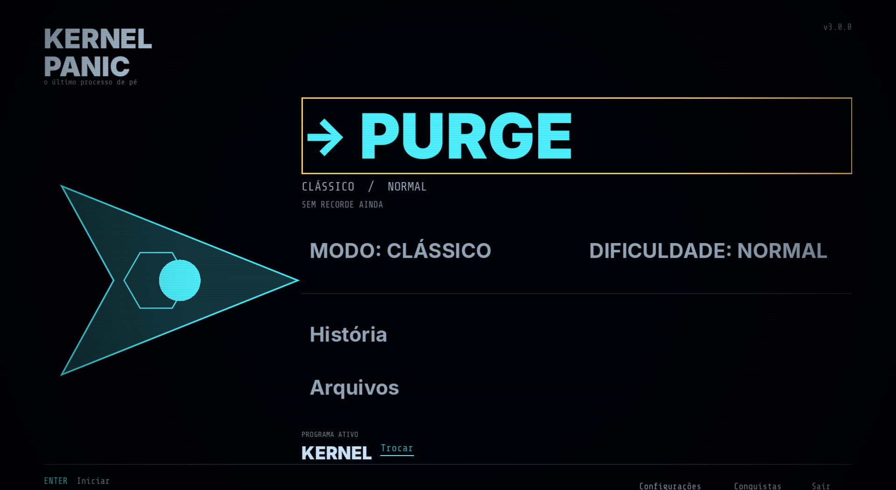
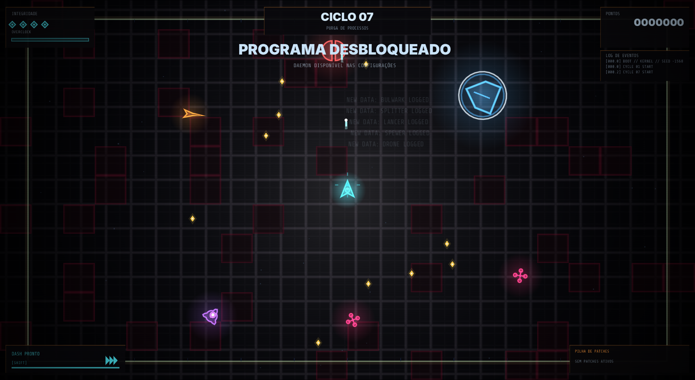

# KERNEL PANIC

<p align="center">
  
</p>

<p align="center">
  <strong>One process left. Everything else wants it dead.</strong>
</p>

<p align="center">
  <a href="https://github.com/mafuzyk/kernel-panic/releases/latest"></a>
  
  <a href="LICENSE"></a>
</p>



KERNEL PANIC is a fast arena shooter about keeping one stubborn process alive while corrupted daemons close in. Move, aim, purge, collect memory motes, and push the system into overclock before the next cycle gets worse.

It started as a small mobile game experiment and slowly became a complete little arcade game. No accounts, no ads, no energy system. Open it, hit **PURGE**, and try to survive longer than last time.

## Yes, this was made on a phone

This whole game was made by a 17-year-old girl on an Android phone, inside Termux, without ADB and without root. It started out of boredom and as a way to study game development. The rest was stubbornness, dreams, and hope holding everything together.

Somehow, it worked.

## Play it

Grab the Android, Linux, or Windows build from the [latest release](https://github.com/mafuzyk/kernel-panic/releases/latest). The current release is `v2.4.7`.

## Install the game

### Android

1. Download `KERNEL-PANIC-v2.4.7-release.apk` from the latest release and open it from your browser or file manager.
2. If Android blocks the installation, allow that app to **Install unknown apps** in the system settings, then open the APK again.
3. Confirm **Install**. The current export targets 64-bit ARM devices (`arm64-v8a`).

KERNEL PANIC does not request network access and stores progress locally.

### Linux x86_64

Download the single `kernel-panic` executable from the latest release. The project data is embedded in the binary, so no separate `.pck` file is required. Then run:

```sh
chmod +x kernel-panic
./kernel-panic
```

For a local export from this repository, the executable is generated at `build/linux-x86_64/kernel-panic`.

To update an installed release, download the newer `kernel-panic` executable,
replace the old file in the same directory, and keep its execute permission:

```sh
cp ~/Downloads/kernel-panic ./kernel-panic
chmod +x ./kernel-panic
```

The game has no in-game updater yet. Your local save data is kept separately
by Godot, so replacing the executable does not remove the save.

### Windows x86_64

Download `kernel-panic.exe` from the latest release and double-click it to run the game. The project data is embedded in the executable. The Windows debug build is `kernel-panic-debug.exe` and is intended for testing.

## How it plays



- Clear each cycle before the arena fills up.
- Collect memory motes from defeated daemons.
- Trigger **Overclock** for a burst of firepower.
- Build a run from patches such as ricochet, heavy rounds, chain reactions, and system restore.
- Fight a different ROOT process every fifth cycle.
- Learn enemy behavior in the built-in bestiary.

Your first arena run introduces movement and dash timing, then surfaces a short tactical hint the first time key threats appear. Bestiary records unlock when a daemon enters the arena, so you can learn what you are facing before you purge it.

Three run modes change the rules:

- **Classic** is the full escalating run.
- **Weekly Run** uses a shared local deterministic seed; your selected aim mode, including lock-on, remains active.
- **One-HP** gives you one mistake and no excuses.

## Controls

### Android

- Left side: move
- Right side: aim and fire
- On-screen buttons: dash, overclock, pause, and settings

### Desktop

- `WASD`: move
- Mouse: aim and fire
- `Shift`: dash
- `E`: overclock
- `Esc`: pause
- `Q` while paused: press twice within 2 seconds to abandon the run
- `M`: mute

On desktop, open **SETTINGS** to remap movement, dash, overclock, pause,
abandon, mute, restart, and confirm keys. Select an action and press the new
physical key; **Escape** cancels, duplicate keys are rejected, and
**RESET KEYBINDS** restores the defaults. Mouse aim/fire is not remapped.

## Run and build from source on Linux

KERNEL PANIC is built with **Godot 4.7.2** and GDScript.

1. Clone this repository and enter its directory. The source build instructions below target Linux x86_64; the Windows release is distributed as a prebuilt executable.
2. Open `project.godot` in Godot.
3. Press `F5` to run the project.

To create a Linux x86_64 build, install the Godot export templates and run:

```sh
mkdir -p build/linux-x86_64
godot --headless --path . --export-release "Linux x86_64" build/linux-x86_64/kernel-panic
```

The project data is embedded in the exported Linux executable. The project includes an automated harness that can be run with:

```sh
godot --headless --path . -- --autotest
```

## A small technical note

Most of the game's look is drawn in code instead of being assembled from a large sprite library. The neon grid, ships, enemies, projectiles, hit effects, UI, and boss telegraphs all come from a deliberately small set of assets and GDScript systems. Audio is generated locally and imported through Godot's normal audio pipeline.

The project includes an automated gameplay harness covering core combat, upgrades, bosses, touch controls, and run flow. It is still a small game, though. If you find something strange, opening an issue is welcome.

## License

Source code is available under the [MIT License](LICENSE).

Made by [mafuzyk](https://github.com/mafuzyk).
